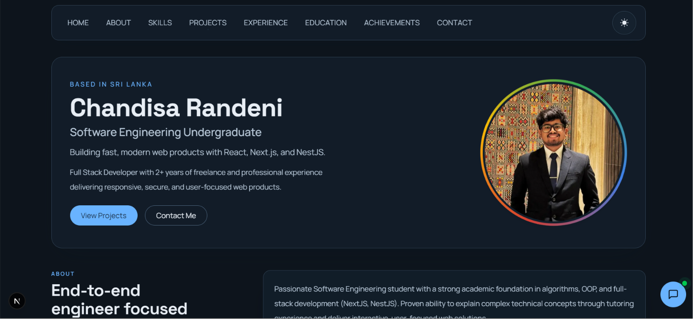

<div align="center">
  <h1>✨ Chandisa Randeni - Personal Portfolio ✨</h1>
  <p>A modern, interactive, and beautifully designed personal portfolio showcasing my skills, projects, experience, and achievements.</p>

  <!-- Badges -->
  <p>
    
    
    
    
    
  </p>
  
  <br />

  <!-- Hero Section Screenshot -->
  <!-- ⚠️ Note: Replace './public/images/hero-screenshot.png' with the actual path to your screenshot -->
  
</div>

---

## 🚀 Overview

Welcome to the source code of my personal portfolio website! This project serves as a comprehensive digital resume, showcasing my professional journey, technical expertise, and featured projects. It is crafted with a focus on performance, modern aesthetics, and smooth user interactions.

## 👨‍💻 About Me
Passionate Software Engineering student with a strong academic foundation in algorithms, OOP, and full-stack development (NextJS, NestJS). Proven ability to explain complex technical concepts through tutoring experience and deliver interactive, user-focused web solutions.

Eager to contribute technical skills in frontend/backend development to an internship role, while expanding expertise in modern software engineering practices, CI/CD, and scalable architecture.

A proactive collaborator dedicated to writing clean, maintainable code and solving real-world problems.

## 💼 Experience

**Tutor (Part-Time) @ NIBM Worldwide Colombo 07**
*Jun 2025 - Present | Colombo, Sri Lanka*
- Mentored students in C, C#, Java, web development, and database fundamentals.
- Explained technical concepts in simple, actionable steps.
- Supported coursework and lab exercises with structured troubleshooting.

**Open Source Software Developer (Freelance) @ Innozoft**
*Mar 2024 - Present | Sri Lanka*
- Delivered frontend and full stack solutions for real client needs.
- Managed feature planning, implementation, and support iterations.
- Built clean interfaces for dashboards, portfolio sites, and student-oriented tools.

## 🎓 Education

**BSc (Hons) Computer Science with Applied Artificial Intelligence**
*National Institute of Business Management ( NIBM ) | 2024 - Present*
- BSc (Hons) Computer Science with Applied Artificial Intelligence | (reading)
- Higher National Diploma in Software Engineering | GPA: 3.85/4.0
- Diploma in Software Engineering | GPA: 3.91/4.0
- Certificate in Software Engineering | Best Performance: 97.7%

**Diploma in Information and Communication Technology**
*IMBS Green Campus | 2024 - 2025*
- Diploma in Information and Communication Technology | GPA: 4.0/4.0
- Awarded Prof. Sarath Amunugama Gold Medal

**Certificate in Cyber Security and Networking**
*NextGen Campus | Apr 2021 - Oct 2021*

**Introduction in Networking - CCNA1v7**
*SLIIT | 2020 - 2021*

## 🏆 Achievements

- **Prof. Sarath Amunugama Gold Medal** (IMBS Green Campus, 2025)
  Recognized for outstanding academic performance in Diploma in Information Technology.
- **Sri Lanka School of Internet Governance (lkSIG) | Fellowship** (lkSIG, 2025)
  Awarded a fellowship to participate in the Sri Lanka School of Internet Governance (lkSIG), engaging in comprehensive discussions and training on internet governance topics.
- **ICACIT 2026 | Organizing Committee** (ICACIT, 2026)
  Participated in planning and execution activities as part of the organizing team for the ICACIT conference.
- **NIBMCodeX 1.0 | IEEEXtreme 19.0 - Logistics Team Member** (IEEE / NIBM, 2024)
  Served as a Logistics Team Member, contributing to coordination and operational support during the competition.

## 🚀 Projects

- **Innozoft Official Website** *(Frontend Developer)* - Built the official website for Innozoft Solutions with modern, responsive layouts and interaction-focused user flows.
- **TrackAdemic** *(Full Stack Developer)* - Developing a full stack educational productivity platform with student portals, analytics, and progress tracking workflows.
- **Lab Ticket** *(Web Application Support)* - Supported optimization of a blood tube issuing workflow at Apeksha Hospital, Maharagama by improving process efficiency and usability.
- **Professional Animix** *(Frontend Developer)* - Developing an open source platform for reusable CSS and JavaScript animations tailored for modern web development.

## ✨ Key Features

- **Comprehensive Sections**: Includes dedicated sections for Hero, About, Skills, Projects, Experience, Education, and Achievements.
- **Modern Tech Stack**: Powered by **Next.js 16 (App Router)** and **React 19**.
- **Stunning UI**: Styled meticulously with **Tailwind CSS v4** for a fully responsive, premium, and beautiful design.
- **Fluid Animations**: Utilizing **Framer Motion** for engaging micro-interactions, scroll reveals, and page transitions.
- **Smooth Scrolling**: Implemented with **Lenis** to provide a premium, buttery-smooth scrolling experience.
- **Type-Safe & Scalable**: Written completely in **TypeScript** with modular components and a data-driven approach using JSON seed files.

## 🛠️ Getting Started

Follow these steps to set up the project locally on your machine.

### Prerequisites

Make sure you have [Node.js](https://nodejs.org/) installed (version 20 or higher is recommended).

### Installation

1. **Clone the repository:**
   ```bash
   git clone https://github.com/chandisarandeni/chandisarandeni-me.git
   cd chandisarandeni-me
   ```

2. **Install dependencies:**
   ```bash
   npm install
   # or yarn install / pnpm install / bun install
   ```

3. **Run the development server:**
   ```bash
   npm run dev
   ```

4. **View the application:**
   Open [http://localhost:3000](http://localhost:3000) in your browser to see the result. You can start editing the page by modifying `app/(portfolio)/page.tsx`. The page auto-updates as you edit the file.

## 📁 Project Structure

This project follows the Next.js App Router architecture. Codebase structure:
- `/app`: Contains the application routes, main pages, and layout (`globals.css`, `layout.tsx`, `page.tsx`).
- `/src/_pages/home`: Houses the core page composition and components (e.g., `HeroSection`, `AboutSection`, `ProjectsSection`, etc.).
- `/src/_pages/home/seeds`: Contains JSON data files (`about.json`, `projects.json`, `experience.json`, etc.) that populate the portfolio content, making it easy to update without touching the UI code.
- `/public`: Static assets like images and fonts.

---
<div align="center">
  <i>Built with ❤️ by Chandisa Randeni</i>
</div>
